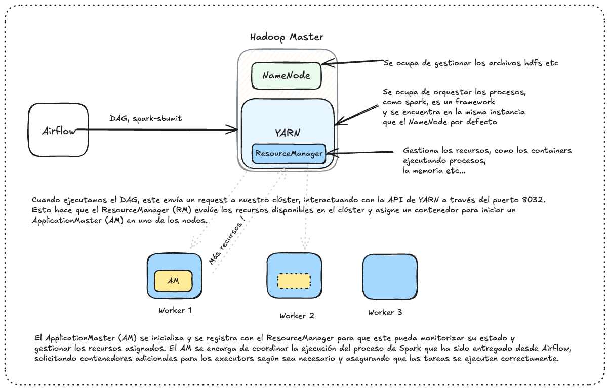
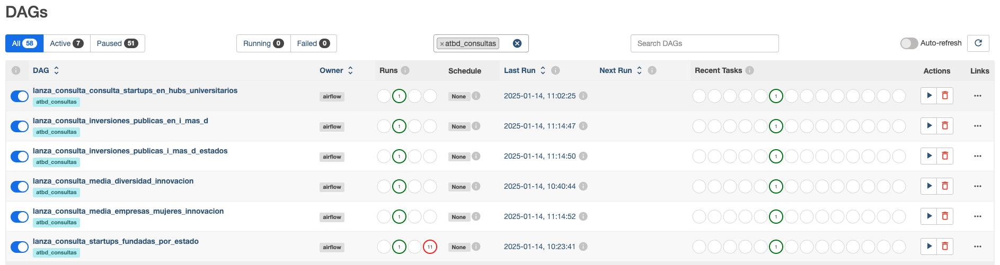
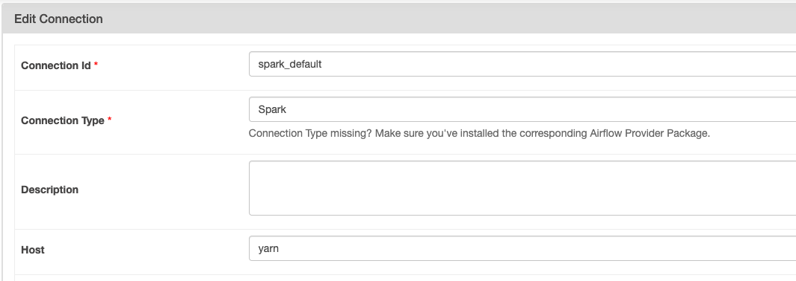

# ATBD Trabajo Grupal

### Arquitectura de la Solución

Hemos mantenido la arquitectura utilizada previamente para desplegar el clúster de Hadoop y hemos añadido una instancia adicional para ejecutar **Airflow** en ella.



### Airflow como Orquestador

Utilizamos **Airflow** para orquestar la ejecución de los procesos de consulta de Spark a través de YARN. Para ello, generamos DAGs agrupados bajo la etiqueta `atb_consultas`.



#### Configuraciones de Airflow

Para solucionar problemas de dependencias y configuración, generamos un archivo ZIP que incluye todos los JAR necesarios para ejecutar nuestros scripts de consultas. Este archivo se pasa al DAG como parte de la configuración (`conf`). Además, especificamos las ubicaciones de los archivos XML necesarios para una conexión adecuada con la API de YARN:

```python
conf={
    'spark.executor.memory': '1g',
    'spark.executor.cores': '1',
    'spark.yarn.archive': 'hdfs://172.31.20.226:9000/user/ec2-user/spark-hadoop-libs.zip',
},
env_vars={
    'HADOOP_CONF_DIR': '/etc/hadoop/conf',
    'YARN_CONF_DIR': '/etc/hadoop/conf',
},
```
También utilizamos el conector de Spark para Airflow, donde simplemente especificamos el tipo y configuramos YARN como host:



---

### Consultas Realizadas

Nuestro objetivo ha sido visualizar tendencias dentro de las industrias de innovación e investigación en Estados Unidos, utilizando contratos públicos como referencia. Para ello, empleamos tres datasets. En el caso de **USASpending**, los datos estaban divididos por años, y cada año contenía varios CSV con un tamaño máximo de 2.2 GB.

#### Áreas Analizadas:

1. **Tendencias de Inversión**: Analizamos las cantidades invertidas a lo largo de los años.
2. **Distribución Geográfica**: Identificamos los cambios en los estados que recibieron financiación.
3. **Industrias de I+D**: Observamos las áreas de investigación y desarrollo que captaron mayor inversión.
4. **Creación de Empresas y Gastos Públicos**: Comparación de los estados donde se crearon empresas con los gastos públicos realizados en esos estados.
5. **Diversidad en las Empresas**:
   - Número de empresas representativas de minorías o clasificadas bajo el tipo "diversidad".
   - Porcentaje de estas empresas dirigidas, fundadas o mayoritariamente gestionadas por mujeres.

---

Con esta solución, hemos logrado integrar Airflow como herramienta central para la orquestación de consultas complejas y análisis en entornos distribuidos, mejorando la eficiencia y escalabilidad de nuestro flujo de trabajo.

---
### Uso de ChatGPT en el Proyecto

A lo largo del desarrollo del proyecto, hemos utilizado **ChatGPT** como herramienta de apoyo para solucionar problemas relacionados con:

1. **Arquitectura**: Identificar y solucionar problemas en la configuración de los diferentes componentes de la arquitectura, como Hadoop, Airflow y YARN.
2. **Consultas**: Obtener sugerencias y ejemplos para optimizar consultas de Spark y mejorar el rendimiento.
3. **Formatos de Datos**: Determinar los formatos más adecuados para almacenar y procesar los datos. Optamos por **Parquet** debido a su eficiencia en compresión y procesamiento.
4. **Resolución de Errores**: Diagnosticar y resolver errores en tiempo real durante la integración de los distintos sistemas y scripts.
5. **Generación de grafos complejos**:.
El uso de ChatGPT nos permitió ahorrar tiempo y enfocarnos en aspectos clave del proyecto, asegurando una implementación más eficiente y robusta.

---
Autores:
Javier Ibarra, Iker Martinez-Ayo, Unai Motriko
