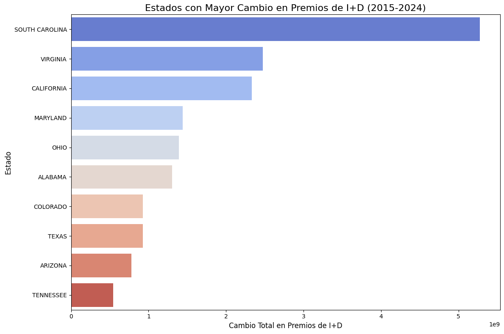

#### Codigo para generar el gráfico
```python
import matplotlib.pyplot as plt
import seaborn as sns


plt.figure(figsize=(12, 8))
sns.barplot(
    data=top_changed_states,
    x="change",
    y="recipient_state_name",
    palette="coolwarm"
)
plt.title("Estados con Mayor Cambio en Premios de I+D (2015-2024)", fontsize=16)
plt.xlabel("Cambio Total en Premios de I+D", fontsize=12)
plt.ylabel("Estado", fontsize=12)
plt.tight_layout()
plt.show()
```
#### Gráfico resultante

