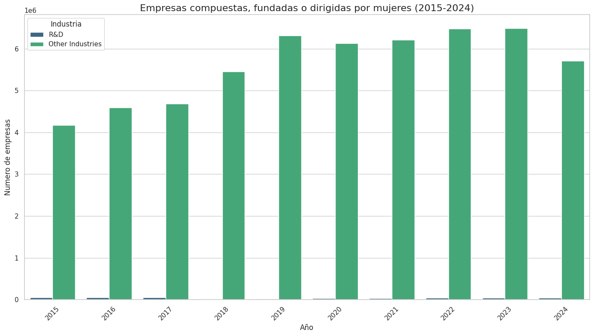

```python
import pandas as pd
import matplotlib.pyplot as plt
import seaborn as sns


data = {
    "action_date_fiscal_year": [2015, 2015, 2016, 2016, 2017, 2017, 2018, 2018, 2019, 2019, 2020, 2020, 2021, 2021, 2022, 2022, 2023, 2023, 2024, 2024],
    "industry_category": ["R&D", "Other Industries", "Other Industries", "R&D", "R&D", "Other Industries", "Other Industries", "R&D", "R&D", "Other Industries", "Other Industries", "R&D", "Other Industries", "R&D", "R&D", "Other Industries", "R&D", "Other Industries", "R&D", "Other Industries"],
    "women_diverse_business_count": [0, 0, 0, 0, 0, 0, 0, 0, 0, 0, 0, 0, 0, 0, 0, 0, 0, 0, 0, 0],
    "non_women_diverse_business_count": [55453, 4171821, 4592345, 58092, 59639, 4684269, 5452439, 10940, 22138, 6316819, 6125332, 31253, 6208902, 37796, 44774, 6481785, 45985, 6486921, 43227, 5713599]
}
df = pd.DataFrame(data)


sns.set(style="whitegrid")


plt.figure(figsize=(14, 8))
sns.barplot(
    data=df,
    x="action_date_fiscal_year",
    y="non_women_diverse_business_count",
    hue="industry_category",
    palette="viridis"
)


plt.title("Empresas compuestas, fundadas o dirigidas por mujeres (2015-2024)", fontsize=16)
plt.xlabel("Año", fontsize=12)
plt.ylabel("Numero de empresas", fontsize=12)
plt.legend(title="Industria")
plt.xticks(rotation=45)

plt.tight_layout()
plt.show()
```


