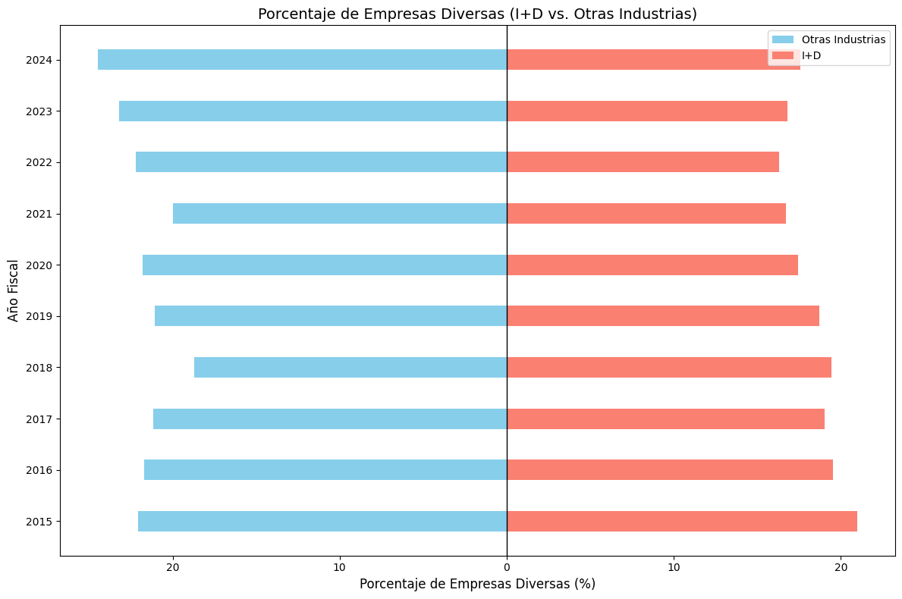

```python
import matplotlib.pyplot as plt
import numpy as np

# Datos generado por consulta
years = [2015, 2016, 2017, 2018, 2019, 2020, 2021, 2022, 2023, 2024]
diverse_rnd = [11636, 11350, 11361, 2125, 4142, 5454, 6325, 7292, 7738, 7604]
non_diverse_rnd = [43817, 46742, 48278, 8815, 17996, 25799, 31471, 37482, 38247, 35623]
diverse_other = [920410, 996023, 990208, 1020610, 1331343, 1334151, 1240562, 1437952, 1506032, 1399451]
non_diverse_other = [3251411, 3596322, 3694061, 4431829, 4985476, 4791181, 4968340, 5043833, 4980889, 4314148]

# Calculate porcentajes
rnd_percentage = [
    (diverse / (diverse + non_diverse)) * 100
    for diverse, non_diverse in zip(diverse_rnd, non_diverse_rnd)
]
other_percentage = [
    (diverse / (diverse + non_diverse)) * 100
    for diverse, non_diverse in zip(diverse_other, non_diverse_other)
]


y = np.arange(len(years))  # Y-axis positions for years
bar_width = 0.4  # Width of each bar


fig, ax = plt.subplots(figsize=(12, 8))


ax.barh(y, [-percent for percent in other_percentage], bar_width, label="Otras Industrias", color="skyblue")


ax.barh(y, rnd_percentage, bar_width, label="I+D", color="salmon")


ax.set_yticks(y)
ax.set_yticklabels(years)
ax.set_xlabel("Porcentaje de Empresas Diversas (%)", fontsize=12)
ax.set_ylabel("Año Fiscal", fontsize=12)
ax.set_title("Porcentaje de Empresas Diversas (I+D vs. Otras Industrias)", fontsize=14)
ax.legend()


ax.axvline(0, color="black", linewidth=1)  # Central split line


xticks = ax.get_xticks()
ax.set_xticklabels([abs(int(tick)) for tick in xticks])


plt.tight_layout()
plt.show()


```


