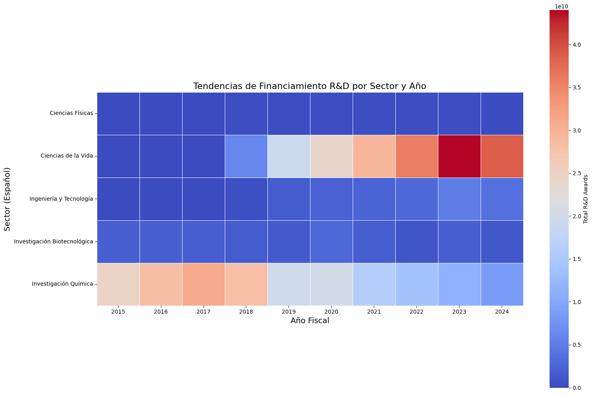

### Codigo para generar la grafica
```python
import pandas as pd
import matplotlib.pyplot as plt
import seaborn as sns

file_path = "/content/part-00000-25163f18-bae6-48fb-af79-437719146fd2-c000.csv"  # Replace with the path to your file
df = pd.read_csv(file_path)

df["naics_code"] = df["naics_code"].astype(str)

df = df.sort_values(by=["action_date_fiscal_year", "total_rnd_awards"], ascending=[True, False])


heatmap_data = df.pivot(index="sector_es", columns="action_date_fiscal_year", values="total_rnd_awards").fillna(0)

heatmap_data = heatmap_data.sort_index(axis=1)

plt.figure(figsize=(16, 10))
sns.heatmap(
    heatmap_data,
    cmap="coolwarm",
    linewidths=0.5,
    cbar_kws={"label": "Total R&D Awards"},
    square=True
)

plt.title("Tendencias de Financiamiento R&D por Sector y Año", fontsize=16)
plt.xlabel("Año Fiscal", fontsize=14)
plt.ylabel("Sector (Español)", fontsize=14)

plt.tight_layout()

plt.show()
```
### Grafica resultante


