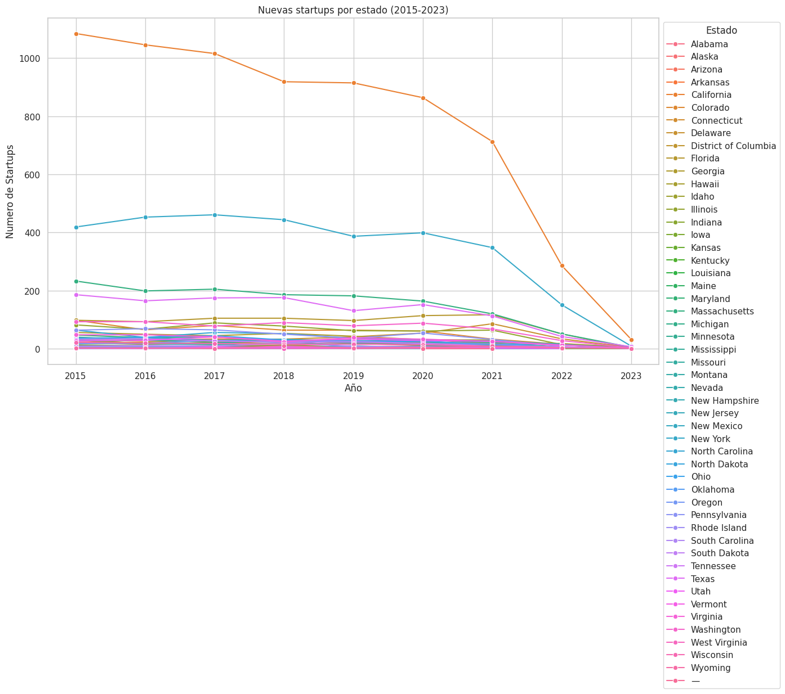

```python
import pandas as pd
import matplotlib.pyplot as plt
import seaborn as sns

file_path = "/content/part-00000-9c67082d-9f0b-4a45-aa79-97941aec6f94-c000.csv"  
data = pd.read_csv(file_path)

grouped_data = data.groupby(["year", "state"])["company_count"].sum().reset_index()


plt.figure(figsize=(14, 8))
sns.lineplot(data=grouped_data, x="year", y="company_count", hue="state", marker="o")
plt.title("Nuevas startups por estado (2015-2023)")
plt.xlabel("Año")
plt.ylabel("Numero de Startups")
plt.legend(loc="upper left", bbox_to_anchor=(1, 1), title="Estado")
plt.show()
```
### Visualización de los resultados
Una de las cosas que observamos fue la tendencia a la baja de la creacion de nuevos startups, que coincide con la ralentizacion de los mercados y la consolidacion de las grandes empresas.


