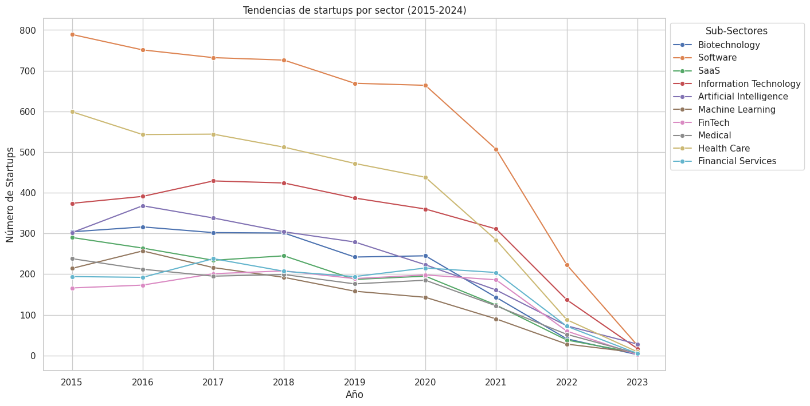

## Script the python para generar el grafico

```python
import pandas as pd
import seaborn as sns
import matplotlib.pyplot as plt
# Load the CSV file
file_path = "/content/part-00000-e9e41cbd-2ac3-4202-865b-04c1c3d0d364-c000.csv"
data = pd.read_csv(file_path)
# Aggregate startup counts by sub-industry
industry_totals = data.groupby("industry")["startup_count"].sum().reset_index()

# Sort by total startups and select the top 10 sub-industries
top_industries = industry_totals.sort_values(by="startup_count", ascending=False).head(10)

# Filter the main data for these top industries
filtered_data = data[data["industry"].isin(top_industries["industry"])]

# Pivot the data for growth calculation
growth_data = data.pivot(index="industry", columns="year", values="startup_count").fillna(0)

# Calculate growth as the difference between the last and first year
growth_data["growth"] = growth_data[2023] - growth_data[2015]

# Sort by growth and select the top 10 sub-industries
highest_growth_industries = growth_data.sort_values(by="growth", ascending=False).head(10).reset_index()

# Filter the main data for these sub-industries
filtered_growth_data = data[data["industry"].isin(highest_growth_industries["industry"])]

# Check filtered data
print(filtered_growth_data.head())
import matplotlib.pyplot as plt
import seaborn as sns

# Line plot for top sub-industries
plt.figure(figsize=(14, 8))
sns.lineplot(data=filtered_data, x="year", y="startup_count", hue="industry", marker="o")
plt.title("Tendencias de startups por sector (2015-2024)")
plt.xlabel("Año")
plt.ylabel("Número de Startups")
plt.legend(loc="upper left", bbox_to_anchor=(1, 1), title="Sub-Sectores")
plt.show()
plt.tight_layout()
plt.show()
```

### Visualización de los resultados
Una de las cosas que observamos fue la tendencia a la baja de la creacion de nuevos start ups, que coincide con la ralentizacion de los mercados y la consolidacion de las grandes empresas.


